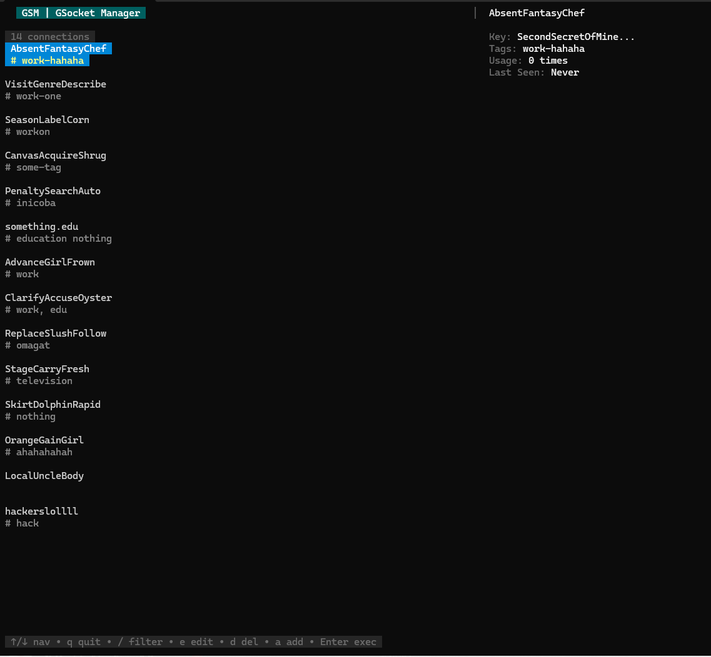

# GSM - GSocket Manager

[](CHANGELOG.md) [](https://goreportcard.com/report/github.com/NumeXx/gsm) [](https://opensource.org/licenses/MIT)

**Connect like there's no firewall, but with style, a kick-ass TUI, and powerful CLI features!**

GSM (GSocket Manager) is a sleek, terminal-based utility to streamline your `gsocket` (Global Socket) connections. Inspired by the simplicity and power of tools like `ssm` (Secure Shell Manager), GSM brings a user-friendly Terminal User Interface (TUI) and a versatile Command Line Interface (CLI) to the world of `gsofcket`, making it a breeze to manage, connect to, and organize your secure, firewall-bypassing endpoints.

Stop fumbling with long `gs-netcat` commands and cryptic keys. With GSM, all your `gsocket` connections are just a few keystrokes or a simple command away.



## ✨ Features

*   **Intuitive TUI:** A clean and efficient terminal interface built with BubbleTea.
    *   **Realtime Detail Panel:** View comprehensive details (Key, Tags, Usage, Last Seen) of the selected connection instantly alongside the list.
    *   List display inspired by `ssm` for a dense and informative view (`Name` then `# Tags`).
*   **Full In-TUI Connection Management:**
    *   **Add (`a` key):** Add new GSocket connections. 
        *   **Automatic Mnemonic Names:** If the name is left blank, GSM auto-generates a memorable 3-word name from the GSocket Key!
    *   **Edit (`e` key):** Modify existing connections (name, key, tags) seamlessly.
    *   **Delete (`d` key):** Remove connections with a confirmation step.
*   **Quick Connect:** Select a connection from the TUI list and hit `Enter` – you're in!
*   **Real-time Filtering:** Simply type in the TUI to filter connections by name or tags. Press `Esc` to clear.
*   **Powerful CLI Importer:**
    *   `gsm import --secret "YOUR_KEY#tag1,tag2"`: Import a single GSocket key, with optional tags. A mnemonic name is auto-generated.
    *   `gsm import --file /path/to/keys.txt`: Bulk import GSocket keys from a text file (one `KEY#tag1,tag2` per line). Names are auto-generated, tags are parsed if present.
    *   Intelligent duplicate checking for names and keys during import.
    *   Colorful and informative CLI output.
*   **Connection Tracking:** 
    *   `Usage` count for each connection.
    *   `LastConnected` timestamp automatically updated.
*   **Configuration Storage:** Connections are stored in a human-readable JSON format (`~/.gsm/config.json`).

## 🎯 Who is this for? / Use Cases

GSM is perfect for:

*   **`gsocket` / `gs-netcat` power users:** Manage numerous `gsocket` endpoints without memorizing keys or complex commands.
*   **Pentesters & Security Researchers:** Quickly switch between `gs-netcat` listeners, reverse shells, or other `gsocket`-tunneled services.
*   **Sysadmins & Developers:** Easily access firewalled or NAT-ed machines for remote administration or development via `gsocket`.
*   **Anyone tired of typing long `gs-netcat` commands:** GSM provides a friendly TUI and quick CLI shortcuts.

If you need to reliably connect to services hidden behind firewalls/NATs using the magic of `gsocket`, GSM will be your best friend!

## 🚀 Getting Started

### Prerequisites

*   **Go:** Version 1.18 or higher is recommended.
*   **`gs-netcat`:** (from the [gsocket by The Hackers Choice](https://github.com/hackerschoice/gsocket) suite) must be installed and in your system's `$PATH`.
*   **Supported OS:** Linux, macOS. (Windows, BSDs might work but are not yet officially tested. Contributions welcome!)

### Installation

There are several ways to install GSM:

**Option 1: Using the One-Liner Install Script (Linux/macOS)**

This is the quickest way to get the latest release on Linux and macOS:
```bash
curl -sSL https://raw.githubusercontent.com/NumeXx/gsm/main/scripts/get.sh | bash
```
Or using `wget`:
```bash
wget -qO- https://raw.githubusercontent.com/NumeXx/gsm/main/scripts/get.sh | bash
```
This script will attempt to install `gsm` to a common binary directory (e.g., `/usr/local/bin` or `~/.local/bin`).

**Option 2: Download Pre-compiled Binaries**

You can download pre-compiled binaries for various operating systems and architectures directly from the **[GitHub Releases Page](https://github.com/NumeXx/gsm/releases/latest)**.

Download the appropriate archive (`.tar.gz` or `.zip`) for your system, extract it, and place the `gsm` binary in a directory included in your system's `$PATH` (e.g., `/usr/local/bin` or `~/bin`). Make sure to give it execute permissions (`chmod +x gsm`).

**Option 3: Using `go install` (For Go users)**

If you have Go installed and configured (Go 1.18+):
```bash
go install github.com/NumeXx/gsm@latest
```
Ensure your `$GOPATH/bin` or `$HOME/go/bin` (for Go 1.16+) is in your system's `$PATH`.

**Option 4: Using the Makefile (For building from source)**

Clone the repository, then use the provided Makefile:
```bash
git clone https://github.com/NumeXx/gsm.git
cd gsm
make build # Builds the binary to ./bin/gsm

# Optional: Install to /usr/local/bin (requires sudo)
# make install 
```
Run `make help` to see other available targets like `clean`, `test`, etc.

**Option 5: Manual Build from Source**

```bash
git clone https://github.com/NumeXx/gsm.git
cd gsm
go build -o gsm ./cmd/gsm/ 
# This creates 'gsm' in the current directory.
# Optional: Move the binary to a directory in your PATH
# sudo mv gsm /usr/local/bin/
```

### Quick Usage

1.  **Launch GSM TUI:**
    ```bash
    gsm
    ```
2.  **Import a single secret key (with optional tags):**
    ```bash
    gsm import -s "YOUR_GSOCKET_KEY#project,client-x"
    # Or generate a key and import it immediately (example for bash/zsh)
    gsm import -s "$(gs-netcat -g)#my-temp-server,lab"
    ```
3.  **Import multiple keys from a file:**
    Create a file (e.g., `my_keys.txt`):
    ```
    secretkey1#work,server1
    anothersecretkey2#personal
    justakey3
    ```
    Then run:
    ```bash
    gsm import -f my_keys.txt
    ```

### TUI Keybindings (Main List)

*   **`↑` / `↓` / `j` / `k`**: Navigate connections.
*   **`Enter`**: Connect to the selected endpoint.
*   **`/`**: Enter filter mode (type to filter, `Esc` to clear).
*   **`a`**: Add a new connection.
*   **`e`**: Edit the selected connection.
*   **`d`**: Delete the selected connection (with confirmation).
*   **`q` / `Ctrl+C`**: Quit GSM.

## 🛠️ Configuration

GSM stores its configuration in `~/.gsm/config.json`. While you can view it, using the in-TUI features (`a`, `e`, `d`) or CLI `import` commands is recommended for modifications.

**Example `config.json` entry:**
```json
    {
      "name": "GeneratedMnemonicName",
      "key": "your-actual-gsocket-secret-key",
      "tags": ["imported", "awesome"],
      "usage": 1,
      "last_connected": "2023-10-28T10:30:00Z"
    }
```

## 🤝 Contributing

Contributions, issues, and feature requests are welcome! Please feel free to check the [issues page](https://github.com/NumeXx/gsm/issues) (or create one!).

1.  Fork the Project
2.  Create your Feature Branch (`git checkout -b feature/AmazingFeature`)
3.  Commit your Changes (`git commit -m 'Add some AmazingFeature'`)
4.  Push to the Branch (`git push origin feature/AmazingFeature`)
5.  Open a Pull Request

## 📜 License

Distributed under the [MIT License](LICENSE). (Ensure you have a `LICENSE` file in your repo).

## 🙏 Acknowledgements

*   **[gsocket](https://github.com/hackerschoice/gsocket) by The Hackers Choice (THC) & Skyper:** For the incredible Global Socket technology that makes this tool possible and for the direct inspiration and feedback.
*   **[ssm (Secure Shell Manager)](https://github.com/lfaoro/ssm) by Leonardo Faoro:** For the brilliant TUI concept and a great example of a connection manager and (etc... hehehe).
*   **[BubbleTea](https://github.com/charmbracelet/bubbletea) & [Lipgloss](https://github.com/charmbracelet/lipgloss) by Charm:** For the fantastic Go libraries that power the TUI.

---
**GSM - Making `gsocket` a joy to manage!**